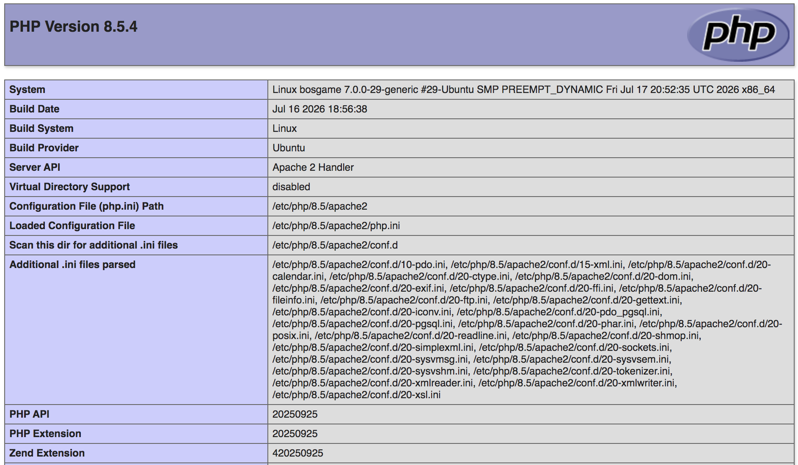

```shell
sudo apt-get install -y php libapache2-mod-php php-pgsql php-xml

php -i | more
```

```console
phpinfo()
PHP Version => 8.5.4

System => Linux bosgame 7.0.0-29-generic #29-Ubuntu SMP PREEMPT_DYNAMIC Fri Jul 17 20:52:35 UTC 2026 
x86_64
Build Date => Jul 16 2026 18:56:38
Build System => Linux
Build Provider => Ubuntu
Server API => Command Line Interface
Virtual Directory Support => disabled
Configuration File (php.ini) Path => /etc/php/8.5/cli
Loaded Configuration File => /etc/php/8.5/cli/php.ini
Scan this dir for additional .ini files => /etc/php/8.5/cli/conf.d
Additional .ini files parsed => /etc/php/8.5/cli/conf.d/10-pdo.ini,
/etc/php/8.5/cli/conf.d/15-xml.ini,
/etc/php/8.5/cli/conf.d/20-calendar.ini,
```

## phpinfo() Web Page

```shell
cd /var/www/html
sudo vi pinfo.php
```

```php
<?php
 phpinfo();
?>
```


